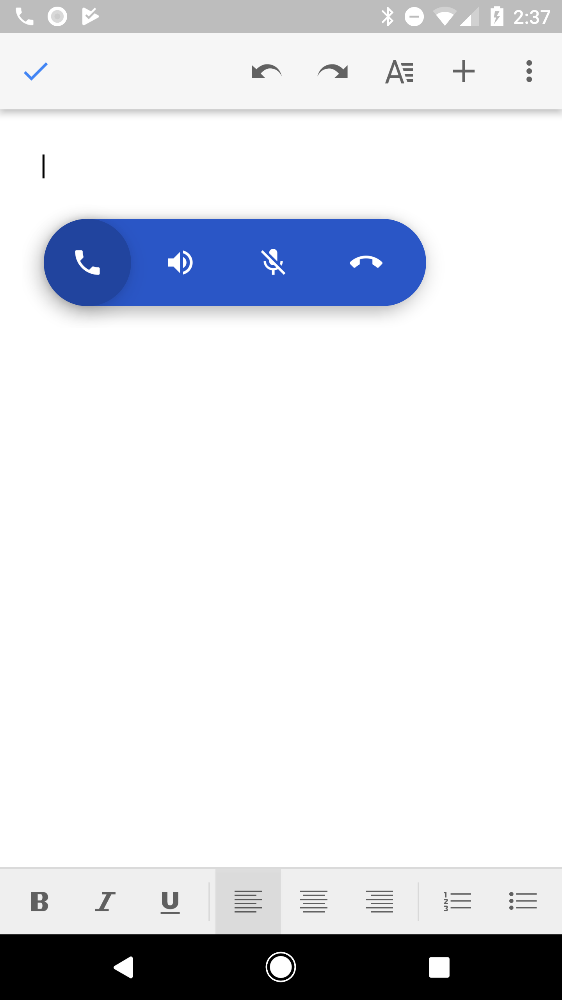

# Floating Bubble Integration

Author: keyboardr@

Last Updated: 2017-06-06

Floating bubbles provide a lightweight means of providing interactive UI while
the user is away from the app. This document details the steps necessary to
integrate these bubbles into your app.

[TOC]

{height=400}

## Ensure Bubbles can be shown

Add the `android.permission.SYSTEM_ALERT_WINDOW` permission to your manifest.
Before you show the bubble, call `Bubble.canShowBubbles(Context)` to see if the
user has granted you permission. If not, you can start an Activity from
`Bubble.getRequestPermissionIntent(Context)` to navigate the user to the system
settings to enable drawing over other apps. This is more than just a simple
runtime permission; the user must explicitly allow you to draw over other apps
via this system setting. System apps may have this allowed by default, but be
sure to test.

## Create your initial `BubbleInfo`

Use `BubbleInfo.builder()` to populate a `BubbleInfo` with your color, main
icon, main Intent (which should navigate back to your app), starting Y position,
and a list of `Actions` to put in the drawer. Each `Action` will define its
icon, user-displayable name (used for content description), Intent to perform
when clicked, whether it is enabled (optional, default true), and whether it is
checked (optional, default false).

{height=400}

## Create, show, and hide the Bubble

Create the bubble using `Bubble.createBubble(Context, BubbleInfo)`. The `show()`
method is safe to call at any time. If the Bubble is already showing, it is a
no-op. `hide()` may also be called at any time and will collapse the drawer
before hiding if already open. While `show()` will show immediately, `hide()`
may need to wait for other operations or animations before the bubble is hidden.
It is unlikely you will need to keep track of this, however. The bubble will be
hidden at its next opportunity, and `hide()` will not block.

{height=400}

## Update the Bubble's state

Call `Bubble.setBubbleInfo(BubbleInfo)` to update all displayed state.
`BubbleInfo`s are immutable, so to make a new one using an existing
`BubbleInfo`, use `BubbleInfo.from(BubbleInfo)` to get a `Builder` with
prepopulated info. If only the `Action` state has changed, it is more efficient
to just call `Bubble.updateActions(List<Action>)`

{height=400}

## Show text

To temporarily replace the icon with a textual message, call
`Bubble.showText(CharSequence)`. The text will be displayed for several seconds
before transitioning back to the primary icon. The drawer will be closed if open
and cannot be reopened while the text is displayed. Any calls to `hide()` will
be deferred until after the text is done being displayed, so if you wish to show
an ending message of some sort you may call `hide()` immediately after
`showText(CharSequence)`.
